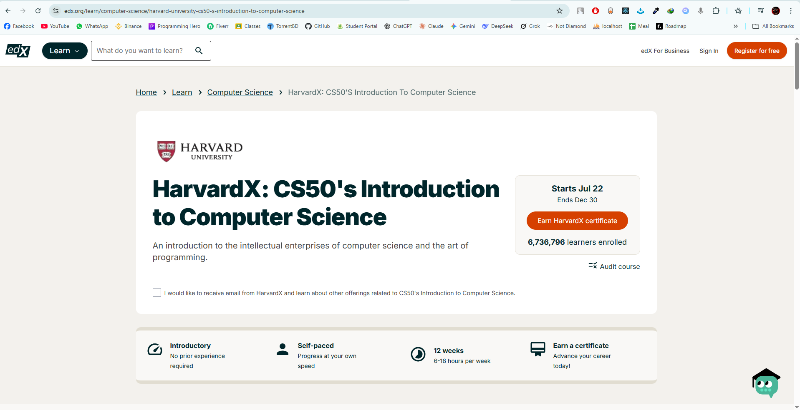

# 💻 Harvard CS50 – Introduction to Computer Science



Welcome! This repository contains my solutions, notes, and projects from [Harvard University's CS50x: Introduction to Computer Science](https://cs50.harvard.edu/x/), taught by Professor David J. Malan.

---

## 📚 About CS50

CS50 is Harvard's introduction to the intellectual enterprises of computer science and the art of programming. It’s a rigorous, entry-level course that covers foundational topics including:

- Algorithms
- Memory
- Data Structures
- Abstraction
- C programming
- Python
- SQL
- HTML, CSS, JavaScript
- Web development
- Cybersecurity
- and more...

---

## 📦 Folder Structure
```
CS50 Code/
├── Week 1/                 
├── Week 2/              
├── ....
├── ....  
├── ....     
└── Week 10/          
```


> Note: Each week folder contains problem sets (`pset`) and any additional practice/lab exercises.

---

## 📝 Disclaimer

All code in this repository is my own work. Sharing these solutions is intended **only for learning purposes** and not for plagiarism. Please use them ethically and abide by [CS50's academic honesty policy](https://cs50.harvard.edu/x/2024/honesty/).

---

## 🚀 Final Project

This will contain a custom project designed and developed using the concepts learned throughout the course. (Coming soon!)

---

## ✅ Progress Tracker

| Week | Topic                  | Status  |
|------|------------------------|---------|
| 0    | Scratch                | ✅ Done |
| 1    | C - Basics             |  |
| 2    | Arrays                 | |
| 3    | Algorithms             |  |
| 4    | Memory                 |  |
| 5    | Data Structures        |  |
| 6    | Python                 |  |
| 7    | SQL                    | |
| 8    | HTML, CSS, JavaScript  |  |
| 9    | Flask / Web Apps       | |
| 10   | Final Project          |  |

---

## 🔗 Useful Links

- [CS50 Home Page](https://cs50.harvard.edu/x/)
- [CS50 on edX](https://cs50.edx.org/)
- [CS50 IDE](https://cs50.dev/)
- [Course Syllabus](https://cs50.harvard.edu/x/syllabus/)

---

## 🧠 Author

**Anowarul Asif(_immortal\_)**  
This repository is part of my personal learning journey in computer science and software development. Feel free to explore, comment, and share feedback!

